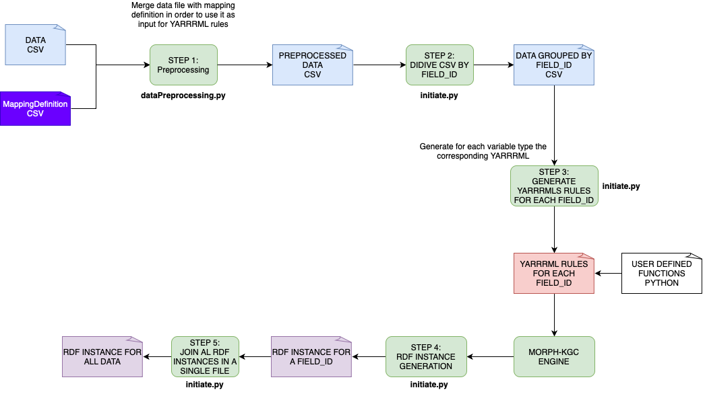

# RDF Builder pipeline
Data pipeline for representing data according in RDF Format



## Requirements

Place both CSV files (data and mappings) in the `upload/input_data` directory:
- `upload/input_data/data.csv`
- `upload/input_data/mappings.csv`

Install requirements.txt libraries

```bash
pip install -r requirements.txt
```

## Preprocessing

Run:
```bash
python3 dataPreprocessing.py <path_to_data_csv> <path_to_mappings_csv> ../preprocessed_data
```

- path_to_data_csv and path_to_mappings_csv should be the location of the corresponding files

- The third argument references the location to which the preprocessed data file is going to be saved. Should not be modified unless the PREPROCESSED_FOLDER constant is also changed in config.py.

This will generate `preprocessed_data/preprocessed_data.csv`.

## RDF Generation

Run:
```bash
python initiate.py ../
```
This will read `preprocessed_data/preprocessed_data.csv` (can be changed by modifying the constants at config.py), and generate a combined RDF file `output_experimento3_uncaso.ttl` in the project root.
